# PKSJ - Tugas 4

## Pendahuluan

**Anggota Kelompok**

| NRP         | Nama                     |
|-------------|--------------------------|
| 5113100050  | Freddy Hermawan Y        |
| 5113100109  | Daniel Fablius           |
| 5113100113  | Muhamad Luthfie La Roeha |

#### Penjelasan Tugas
**Tugas 4 :**
* Instal dionaea honeypot pada suatu OS
* Instal metasploit
* Lakukan uji test serangan dengan menggunakan metasploit. 


## Dasar Teori


**1. OS yang digunakan**

* **Kali Linux** adalah 
Kali Linux adalah salah satu distribusi Linux tingkat lanjut untuk Penetration Testing dan audit keamanan, pembangunan kembali BackTrack Linux secara sempurna,  mengikuti sepenuhnya kepada standar pengembangan Debian.(http://id.docs.kali.org/introduction-id/apa-itu-kali-linux)

* **Ubuntu 14.04 LTS** adalah 
Ubuntu adalah distribusi Linux bebas berlandasan Debian GNU/Linux. (gudanglinux.com/glossary/ubuntu/)

**2. Tools yang digunakan**

*Metasploit* adalah suatu tools yang digunakan untuk uji penetrasi. (https://www.rapid7.com/products/metasploit/) 

*Dionaea honeypot* adalah suatu tools yang digunakan untuk menjebak pelaku attacker dengan memanfaatkan celah malware yang tersedia. (Kuliah PKSJ pertemuan ke 7)

*MHN / Modern Honey Network* adalah suatu tools yang digunakan untuk memanagement multi-snort dan honeypot sensor.(https://github.com/threatstream/mhn) -> optional.


## Persiapan

#### 1. Langkah Instalasi dan konfigurasi Dionaea  Honeypot 
	
Kelompok kami menggunakan Ubuntu versi 14.04 LTS sebagai server yang akan dijadikan honeypot, sehingga dalam kasus ini kita menggunakan dokumentasi yang telah disediakan untuk menginstall di ubuntu 14.04 LTS.
kami juga melakukan panduan instalasi yang terdapat didalam tutorial ([berikut](https://dionaea.readthedocs.io/en/latest/installation.html#ubuntu-14-04)) dengan tahapan sebagai berikut
	
1. Update *package database* dengan perintah 
	```
	$ sudo apt-get update 
	```
	
2. Upgrade seluruh versi software package yang telah terinstall dengan perintah 
	```
	$ sudo apt-get dist-upgrade
	```
	
3. Menginstall tools untuk mengelola sumber daya PPA dengan perintah 
	```
	$ sudo apt-get install software-properties-common
	```
	
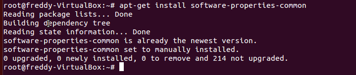
	
4. Menambahkan PPA dionaea honeypot kedalam daftar repository, dengan perintah 
	```
	$ sudo add-apt-repository ppa:honeynet/nightly
	```
	
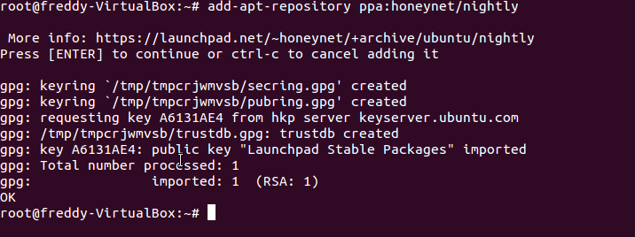	

5. Update *package database* dengan perintah 
	```
	$ sudo apt-get update  
	```
	
6. Menginstall dionaea package dengan perintah 
	```
	$ sudo apt-get install dionaea
	```

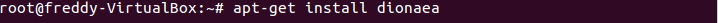

7. Starting dionaea service dengan perintah
	```
	$ sudo service dionaea start
	```
	
	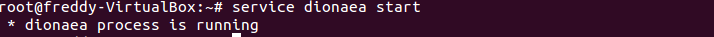

8. Untuk mengecek apakah sudah berhasil atau tidak dengan cara 
	```
	ps aux | grep dionaea
	```

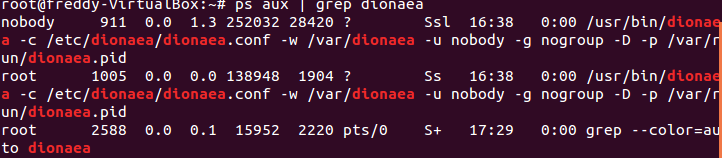

#### 2. Mempersiapkan metasploit, karena metasploit sendiri sudah terinstall dalam Kali Linux maka kami langsung memakainya.
	
	Kelompok kami menggunakan versi GUI dari Metasploit yaitu armitage. 
	
#### 3. Menginstall pembacaan GUI terhadap log yang terjadi di dionaea dengan menggunakan Modern Honey Network. 
	
kami juga melakukan panduan instalasi yang terdapat didalam tutorial ([berikut](https://github.com/threatstream/mhn)) dengan tahapan sebagai berikut
	
1. (jika belum punya git) Menginstall git dengan perintah
	```
	$ sudo apt-get install git -y
	```
	
2. Menaruh peletakan download file dari MHN github. Sebagai contoh kelompok kami menggunakan folder /opt.
	```
	$ cd /opt
	$ sudo git clone https://github.com/threatstream/mhn.git
	$ cd mhn/
	```
	
3. Menginstall MHN.
	```
	$ ./install.sh
	```
	
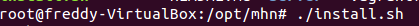

4. Mengonfigurasi MHN. Kelompok kami menggunakan konfigurasi sebagai berikut

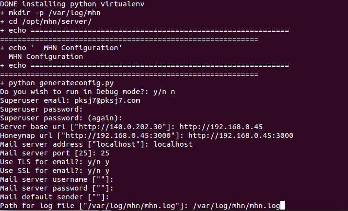
		
5. Konfigurasi dengan splunk, ELK, java8. Kelompok kami menggunakan ELK dan java8
	
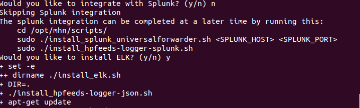
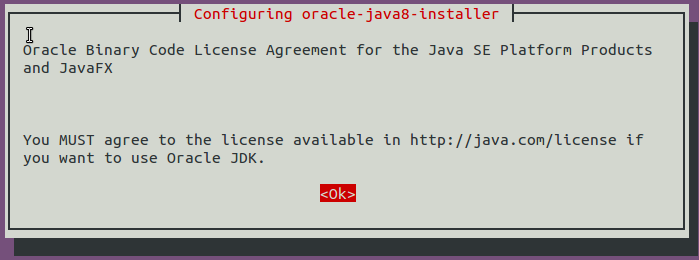
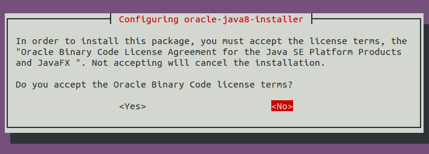
	
6.  Untuk mengecek apakah sudah berhasil atau tidak dengan cara 
	```
	ps aux | grep mhn
	```
	
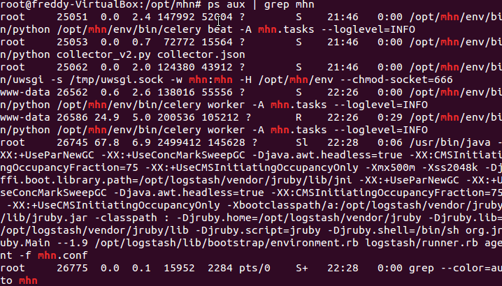
	
7. Buka Browser dan login pada <http://server_base_url>

8. Navigate to “Deploy”, and select “Dionaea Ubuntu” in the list
	
9. Untuk menghubungkan antara MHN dan Honeypot maka menggunakan terminal dan menulisan perintah yang keluar dari langkah nomer 8
	
	```
	wget "http://<ip_of_your_ui_server>/api/script/?text=true&script_id=7" -O deploy.sh && sudo bash deploy.sh http://<ip_of_your_ui_server> <some_key>
	```
	
10. selesai

## Uji Penetrasi

#### 1. Uji 

Pada tahap ini, kami melakukan sebuah skenario uji ...., yaitu :


**Skenario 1** : 

####2. Uji 


**Skenario 1** : 


## Kesimpulan dan Saran
